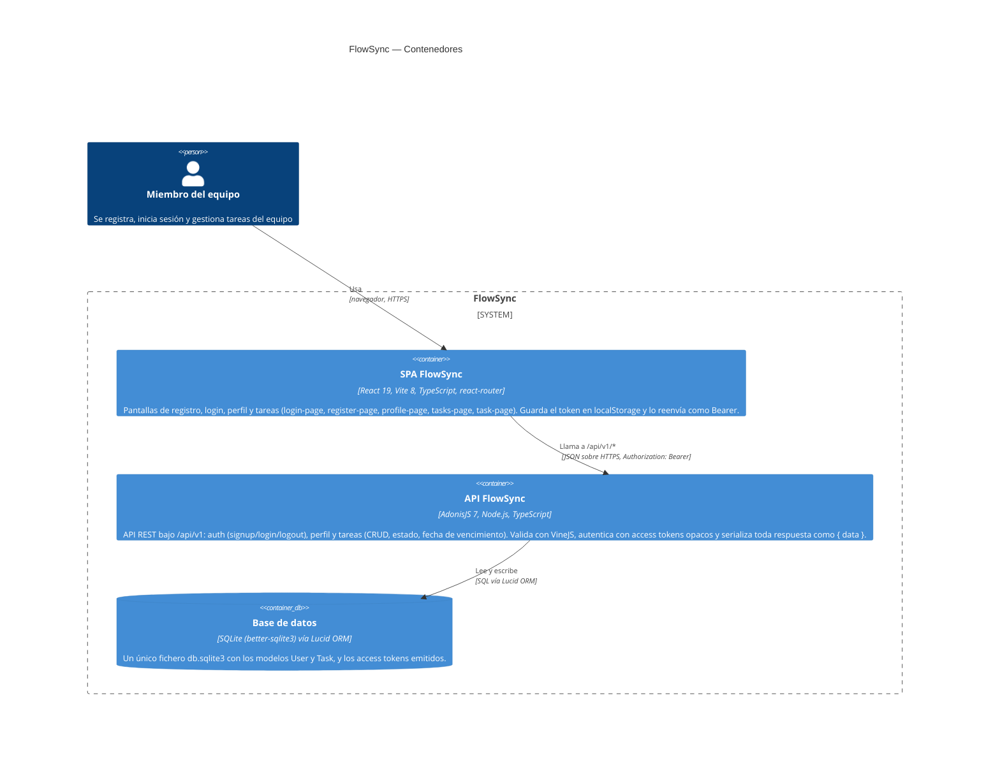

# FlowSync — Diagrama de contenedores (C4, nivel 2)

Generado a partir de la estructura real del monorepo: rutas y controladores de `backend/start/routes.ts`, modelos de `backend/app/models/`, configuración de base de datos en `backend/config/database.ts` y estructura de `frontend/src/`.

## Notas de la arquitectura

- **Contrato tipado entre SPA y API**: `backend/.adonisjs/client/registry/` (Tuyau) se genera en build/boot de la API a partir de rutas y controladores, y el frontend lo consume solo como tipos en tiempo de compilación a través de `frontend/src/lib/api.ts` — no es una llamada en tiempo de ejecución, por eso no aparece como contenedor propio.
- **Un solo fichero SQLite**: tanto la API en modo `dev` como las suites de test functional apuntan al mismo `tmp/db.sqlite3` (sin override por entorno), lo cual es una decisión de diseño relevante a nivel de este contenedor, no un contenedor adicional.
- **Capas dentro de la API** (no representadas en este diagrama de nivel contenedor, ver nivel de componentes si se necesita): controladores (`app/controllers/`) → validadores VineJS (`app/validators/`) → modelos Lucid (`app/models/`) sobre esquema autogenerado (`database/schema.ts`) → transformers (`app/transformers/`) para la respuesta serializada.
- **Puertos por defecto**: API en `http://localhost:3333`, SPA en `http://localhost:5173` (`VITE_API_URL` apunta la SPA a la API).
